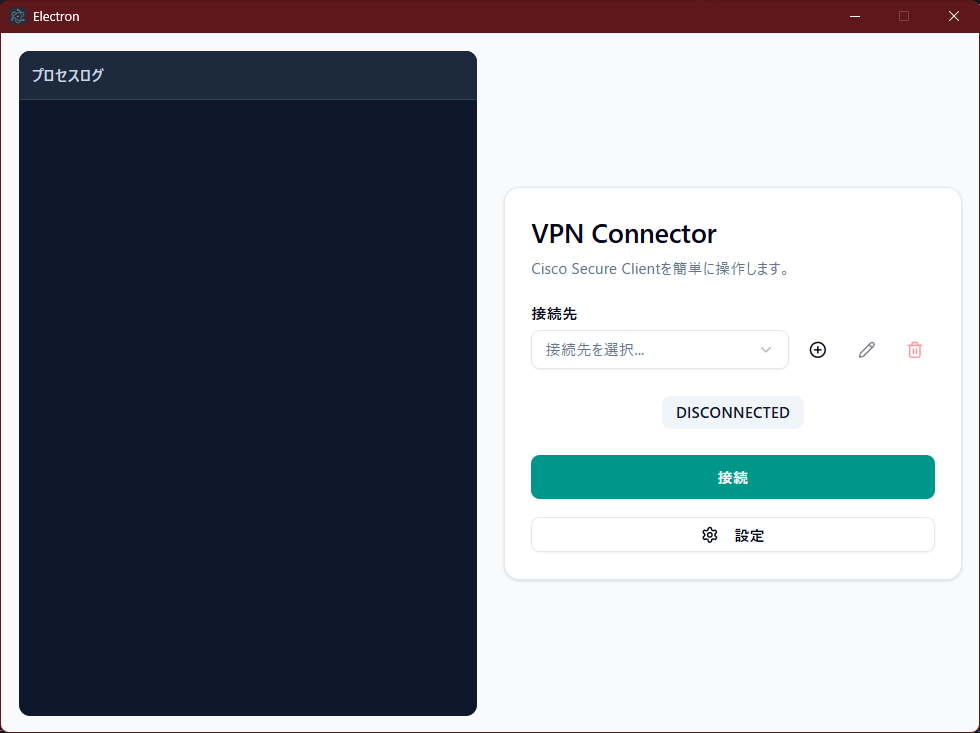

# VPNConnector

Cisco Secure ClientのCLI (`vpncli.exe`) を簡単に操作するための、Windows向けGUIラッパーアプリケーションです。接続情報を安全に保存し、ワンクリックでのVPN接続・切断を実現することで、日々のVPN利用の手間を大幅に削減します。



---

## ⚠️ ご注意

**このアプリケーションは、ご使用のPCにCisco Secure Clientが既にインストールされていることを前提として動作します。**
事前にCisco Secure Clientのインストールを完了させてから、本アプリケーションをご利用ください。

---

## ✨ 主な機能

- **ワンクリック操作**: 単一のボタンでVPNの「接続」「切断」「中断」を直感的に操作できます。
- **プロファイル管理**: 複数のVPN接続情報（表示名、ホスト、ユーザー名）を登録・編集・削除できます。
- **安全なパスワード保存**: パスワードはOS標準の資格情報管理機能を用いて安全に保管されます。
- **リアルタイムログ**: `vpncli.exe`の実行プロセスがリアルタイムで表示され、接続状況を詳細に確認できます。
- **パス設定**: `vpncli.exe`の実行ファイルパスをGUIから簡単に設定・検証できます。
- **自動アップデート**: GitHubのリリースと連携し、新しいバージョンが公開されると自動でアップデートを通知・実行します。

## 🛠️ 技術スタック

- [Electron](https://www.electronjs.org/)
- [React](https://reactjs.org/)
- [TypeScript](https://www.typescriptlang.org/)
- [Vite](https://vitejs.dev/)
- [Tailwind CSS](https://tailwindcss.com/)
- [shadcn/ui](https://ui.shadcn.com/)

## ✅ 動作要件

- **OS**: Windows
- **必須ソフトウェア**: **Cisco Secure Client** がインストールされていること。（特に`vpncli.exe`が必要です）

## 🚀 インストールと使い方

1.  **ダウンロード**
    - [GitHubリリースページ](https://github.com/syugeeeeeeeeeei/VPNController/releases)から、最新バージョンのインストーラー (`VPNConnector-x.x.x-setup.exe`) をダウンロードします。

2.  **インストール**
    - ダウンロードしたインストーラーを実行し、画面の指示に従ってインストールを完了します。

3.  **初期設定**
    - アプリを起動し、右下の「設定」ボタンをクリックします。
    - `vpncli.exe`のパスがご自身の環境と合っているか確認し、異なる場合は正しいパスを入力して「保存」してください。
      - デフォルトパス: `C:\Program Files (x86)\Cisco\Cisco Secure Client\vpncli.exe`

4.  **接続プロファイルの作成**
    - メイン画面の「＋」ボタンから、VPN接続情報を登録します。

5.  **接続**
    - 登録した接続先を選択し、「接続」ボタンをクリックします。

## 👨‍💻 開発者向け

このプロジェクトをローカルで実行またはビルドする手順です。

1.  **リポジトリをクローン**
    ```bash
    git clone [https://github.com/syugeeeeeeeeeei/VPNController.git](https://github.com/syugeeeeeeeeeei/VPNController.git)
    cd VPNController
    ```

2.  **依存関係をインストール**
    ```bash
    yarn install
    ```

3.  **開発モードで起動**
    ```bash
    yarn dev
    ```

4.  **アプリケーションをビルド**
    ```bash
    # Windows向けインストーラーをビルド
    yarn build:win
    ```
    ビルドされた成果物は `dist` ディレクトリに出力されます。
